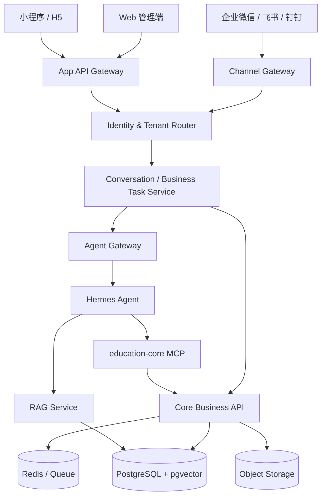

# 独立教师与小机构智能教务系统

> **最终产品与技术方案**  
> 版本：v1.0  
> 日期：2026-06-23  
> 适用对象：独立教师、工作室、1～20 人小型培训机构  
> 产品形态：网页管理端 + 聊天软件入口 + 家长移动入口 + 后台自动化与 Agent 能力

---

## 1. 文档结论

本产品不定位为传统教培 ERP，也不把 AI 做成独立模块。最终形态是：

> **以可靠业务系统为底座，以自然语言作为快捷操作入口，以 Hermes Agent 作为内部任务编排器，以 RAG 作为机构知识层，并通过网页和聊天软件共同提供服务。**

用户在界面中主要看到课表、学员、收费、通知、报表和待办，不看到“AI 摘要”“AI 推荐”“智能体中心”等技术概念。

核心交互原则：

```text
自然语言是快捷入口
表单是完整入口和兜底
业务卡片是核对与确认界面
业务页面是正式结果归属
Core API 是可信执行者
Hermes 是理解和编排层
RAG 是规则与知识查询层
审计流水是可靠性的基础
```

---

## 2. 产品定位

### 2.1 一句话定位

面向独立教师和小机构的轻量教务与经营系统，帮助用户完成学员管理、排课、考勤课消、收费、通知、报表和日常协作，并允许通过一句话快速发起常见业务操作。

### 2.2 目标用户

- 独立教师、个人工作室
- 2～20 人的小型培训机构
- 约 20～2000 名在读学员
- 音乐、美术、舞蹈、体育、语言、编程、文化课等场景
- 一对一、小班、固定班、周期班、预约制课程

### 2.3 核心价值

1. 用户不用学习复杂 ERP 菜单。
2. 高频业务可以通过一句话发起。
3. 复杂业务仍有可靠表单和网页后台。
4. 排课、课时、收费和通知形成完整闭环。
5. 每项业务都可核对、可追踪、可纠错。
6. 网页、聊天软件和家长移动入口共享统一业务状态。

### 2.4 明确不做

首期不建设：

- 显性的“AI 智能体中心”
- AI 空闲时间推荐
- AI 今日摘要模块
- 自研直播课堂
- 完整 OA、人事、库存和采购系统
- 复杂连锁加盟体系
- 由大模型直接决定课时、退款、工资和账务
- 让 Agent 直接连接生产数据库
- 让聊天软件成为唯一入口

---

## 3. 竞品启示与差异化方向

传统国内教培系统通常覆盖招生、教务、财务、家校、库存、人事和营销，功能全面但配置与学习成本较高。海外独立教师工具通常更强调日历、预约、自动账单和教师薪酬，体验较轻，但不完全适应国内课包、课消、家长代付和微信触达场景。

本产品采用以下差异化路线：

```text
国内教务规则
+ 海外日历式体验
+ 自然语言快捷操作
+ 多聊天渠道入口
+ 严格可审计的业务内核
```

重点不是功能数量，而是减少完成同一件事所需的操作步骤。

---

## 4. 产品设计原则

### 4.1 AI 隐入业务

AI 能力分散到课表、学员、收费、通知和报表中，不单独设置 AI 页面。

正确表现：

- 调课页面直接出现可核对的调课方案
- 课堂记录自动整理为结构化内容
- 通知页面出现可编辑的消息草稿
- 报表中出现数据变化说明和明细入口
- 收费页面出现逾期待办和催费草稿

不使用以下文案：

- “AI 为你推荐”
- “AI 今日摘要”
- “AI 洞察”
- “智能体发现”

### 4.2 自然语言优先，表单兜底

```text
一句话描述
→ 系统识别业务意图
→ 补齐必要信息
→ 确定性业务校验
→ 展示影响范围
→ 用户确认
→ 执行并记录
```

每个自然语言功能都必须保留对应表单入口。

### 4.3 规则优先于大模型

可用业务规则、数据库查询和公式明确完成的事情，不调用大模型。

- 冲突检测：规则引擎
- 剩余课时：课时流水
- 可退款金额：退款规则服务
- 教师课酬：课酬计算服务
- 权限判断：RBAC 与数据权限
- 支付状态：支付系统和财务流水
- 文本理解、任务拆解、内容整理：Hermes / LLM

### 4.4 可靠性优先于“智能感”

系统必须让用户清楚知道：

- 系统理解了什么
- 将修改哪些记录
- 是否影响课时、账务和通知
- 谁执行了操作
- 操作是否成功
- 是否可以撤销
- 失败时如何继续

---

## 5. 用户角色

| 角色 | 主要目标 | 主要入口 |
|---|---|---|
| 独立教师 | 排课、点名、课堂记录、收费和通知 | 网页 + 聊天软件 |
| 机构管理员 | 全局排课、学员、权限、经营和审批 | 网页 + 聊天软件 |
| 任课教师 | 今日课程、点名、课堂反馈、学生查询 | 聊天软件 + 移动网页 |
| 财务人员 | 订单、收款、退款、对账和课酬 | 网页为主 |
| 家长 | 查看课程、请假、缴费、接收通知 | 微信小程序或 H5 |
| 学员 | 查看课程、作业和学习记录 | 小程序或 H5 |

---

## 6. 产品入口与信息架构

### 6.1 网页端

网页是完整业务入口和最终兜底入口。

一级导航：

```text
工作台
课表
学员
收费
通知
报表
设置
```

网页承担：

- 完整周历、批量排课和拖拽调课
- 学员档案和家庭账户维护
- 课包、订单、收款、退款和课时核对
- 教师课时与课酬
- 批量导入、导出和数据修复
- 报表明细和指标定义
- 通知模板和发送记录
- 权限、审批、审计和备份管理
- 渠道绑定与自动化配置
- RAG 文档管理

### 6.2 聊天软件入口

聊天入口处理轻量、高频、即时任务：

- 查询今天课程
- 查看下一节课
- 点名
- 填写简短课堂记录
- 创建请假或调课申请
- 查询学员剩余课时
- 查询待收款
- 生成通知草稿
- 审批调课方案
- 接收异常提醒和任务链接

聊天入口命名建议：

```text
教务助手
课程助手
机构服务助手
```

不使用“AI 助手”或“Hermes Bot”等名称。

### 6.3 家长移动入口

建议使用微信小程序或移动 H5，提供：

- 下一节课程
- 课表
- 请假和调课申请
- 剩余课时
- 待缴账单和缴费
- 课堂反馈
- 成长记录
- 消息和通知

复杂问题通过人工联系或网页客服处理，不要求家长在聊天中完成长流程。

---

## 7. 自然语言交互模型

### 7.1 全局入口

网页顶部或移动端工作台提供：

```text
说说你要处理什么……
```

模块内入口带入当前上下文：

```text
课表：安排、调整或查询课程……
学员：记录、查询或联系该学员……
收费：创建订单、记录收款或查询账单……
通知：生成、查询或发送通知……
```

旁边始终保留：

```text
使用表单
```

### 7.2 四级处理模式

#### A. 直接完成

适用于低风险、目标明确、可撤销操作：

- 添加备注
- 创建普通待办
- 保存课堂草稿
- 查询课程、课时或账单
- 生成通知草稿

示例：

```text
用户：给张同学添加备注，下节课带练习册。

系统：已添加到张同学备注。
今天 14:32 · 操作人：王老师
[撤销] [查看学员]
```

#### B. 预览后确认

适用于会修改业务状态或影响其他人的操作：

- 新增课程
- 调课和取消课程
- 点名和请假
- 创建订单
- 记录收款
- 发送通知

```text
调课预览

学员：张子涵
课程：英语一对一
原时间：6 月 26 日 16:00
新时间：6 月 27 日 10:00
教师：王老师
教室：A

校验：
✓ 教师可用
✓ 学员无冲突
✓ 教室可用
✓ 符合机构规则

将产生：
· 修改 1 节课程
· 生成 2 条通知草稿
· 不改变已扣课时

[确认调课] [修改内容] [使用表单]
```

#### C. 追问必要信息

表达不完整时只追问必要字段，一次只问最关键的一项。

```text
用户：给张同学排一节课。

系统：张同学有两个在读课程：
[英语一对一｜王老师]
[数学提高班｜李老师]
```

确认课程后再询问时间，不立即弹出完整表单。

#### D. 转入表单

以下场景主动转入网页表单：

- 大批量排课
- 复杂周期课程
- 多教师联合授课
- 组合课包订单
- 复杂退款
- 批量课时调整
- 工资规则和权限配置
- 数据导入导出
- 长时间无法消除的语义歧义

自然语言中已识别的信息必须自动预填，用户不用重新输入。

---

## 8. 核心业务模块

### 8.1 工作台

工作台只显示明确的业务状态和待办：

- 今日课程
- 待点名
- 待发送通知
- 待确认调课
- 即将用完课时
- 逾期账单
- 待填写课堂记录
- 待审批事项

不显示 AI 摘要。

### 8.2 课表

功能范围：

- 日、周、月和教师视图
- 周期排课和单次排课
- 拖拽调课
- 教师、学员、教室冲突校验
- 节假日和不可用时间
- 课程状态
- 快速点名
- 调课影响预览
- 批量通知

不提供 AI 空闲时间推荐。系统只在用户明确发起排课或调课时查询资源并生成方案。

### 8.3 学员

学员详情统一呈现：

```text
概况
课程
课时
出勤
学习记录
账单
沟通
文件
```

家庭账户与学生档案分开：

- 学生是课程参与者
- 家庭账户是付款人和联系人
- 一个家庭可关联多个孩子

### 8.4 收费

核心对象：

- 课程商品
- 课包
- 订单
- 应收账单
- 收款
- 退款
- 课时流水
- 财务流水
- 教师课酬

用户默认关注：

- 已收金额
- 待收金额
- 已消耗课时
- 应付教师金额

### 8.5 通知

通知模块包含：

```text
待发送
已发送
发送失败
草稿
模板
```

固定业务通知不调用大模型；需要个性化表达、整理上下文或引用规则时才调用 Hermes。

### 8.6 报表

核心报表：

- 收款、退款和欠费
- 课消收入
- 教师课时与课酬
- 到课率和请假率
- 新增、活跃和流失学员
- 续费情况
- 课程和教室利用率

报表数值由 SQL 和统计服务计算。Hermes 只负责将已经计算的数据组织成简洁说明，并必须提供明细入口。

---

## 9. 聊天渠道策略

### 9.1 推荐接入顺序

第一阶段：

```text
Web 管理端
+ 企业微信内部入口
+ 微信小程序/H5 家长入口
```

第二阶段：

```text
飞书
钉钉
```

第三阶段：

```text
其他国际渠道或机构自定义渠道
```

Hermes 已提供企业微信、飞书/Lark、钉钉等消息平台适配能力；企业微信可使用 WebSocket Bot 或自建应用 Callback，飞书和钉钉可使用长连接模式。生产系统仍应在 Hermes 外层增加自有 Channel Gateway，以统一身份、租户、卡片、重试和审计。

### 9.2 聊天和网页共享业务任务

不依赖聊天上下文保存正式业务状态。

```text
用户消息
→ 生成 business_task
→ 生成方案或待办
→ 聊天显示简版卡片
→ 网页显示完整详情
→ 任一入口确认
→ 同一业务任务状态更新
```

共享内容包括：

- 任务状态
- 调课方案
- 审批状态
- 通知草稿
- 关联课程和学员
- 执行结果

### 9.3 身份绑定

聊天昵称不能作为业务身份。通过 `channel_accounts` 建立映射：

```text
channel_type
channel_corp_id
channel_user_id
system_user_id
tenant_id
binding_status
bound_at
```

首次使用时通过网页登录确认或一次性验证码完成绑定。

### 9.4 群聊限制

- 群聊仅在被 @ 时响应
- 默认不能查询财务和完整学员档案
- 不在群聊展示手机号、地址等敏感信息
- 高风险操作转入私聊或网页
- 群内会话按用户隔离
- 教师群仅访问授权班级和学生

---

## 10. 技术总体架构



### 10.1 Core Business API

唯一可信业务来源：

- 用户、机构和权限
- 学员和家庭
- 课程和排课
- 考勤和课消
- 课包和课时流水
- 订单、收款和退款
- 教师课酬
- 通知和报表
- 审计与备份

### 10.2 Channel Gateway

负责：

- 平台签名和回调验证
- 消息去重
- 用户与机构识别
- 平台账号绑定
- 消息格式转换
- 卡片渲染
- 按钮回调
- 附件处理
- 发送重试和限流
- 深链接生成

### 10.3 Agent Gateway

负责：

- 业务上下文构建
- `tenant_id` 和用户权限注入
- Hermes 会话映射
- 模型路由和 Token 限制
- 审批流程
- 工具策略
- 敏感信息脱敏
- Agent 运行状态
- 失败降级
- 结果写回业务任务

### 10.4 Hermes Agent

Hermes 用作内部 Agent 运行时，不作为业务数据库或多租户安全边界。

适合负责：

- 自然语言理解
- 任务拆解
- 多工具编排
- RAG 查询
- 内容整理
- 课堂记录结构化
- 通知草稿生成
- 报表解释
- 定时语言分析任务

不负责：

- 最终权限判断
- 直接数据库写入
- 课时余额计算
- 退款金额计算
- 教师工资计算
- 支付状态判断
- 业务事务提交

Hermes 的程序化集成支持 OpenAI 兼容 HTTP API、SSE 运行事件、审批、停止任务和更细粒度的 JSON-RPC 接口。MVP 推荐通过自建 Agent Gateway 调用 Hermes API Server。

> 截至 2026-06-23，Hermes Agent 最新公开 Release 为 v0.17.0（2026-06-19）。生产部署应锁定经过测试的版本，不自动追踪主分支。

---

## 11. MCP 工具设计

Hermes 不获得 SQL 工具和数据库凭据，只通过专用 `education-core-mcp` 调用业务能力。

### 11.1 查询工具

```text
student_search
student_get_profile
schedule_query
teacher_availability
student_availability
package_get_balance
attendance_get_history
finance_get_summary
notification_get_status
```

### 11.2 方案工具

```text
schedule_propose
schedule_check_conflicts
lesson_cancel_preview
package_adjustment_preview
refund_preview
payroll_calculate_preview
notification_draft
```

### 11.3 普通执行工具

```text
schedule_commit
attendance_mark
lesson_reschedule
invoice_create
notification_send
learning_record_create
```

### 11.4 高风险工具

```text
refund_request
lesson_ledger_adjust
financial_ledger_adjust
contract_cancel
student_data_export
student_archive
```

高风险工具要求管理员权限和二次确认。

### 11.5 写操作协议

所有写操作必须包含：

```text
tenant_id
actor_user_id
agent_run_id
proposal_id
approval_id
expected_version
idempotency_key
operation_reason
```

防止：

- Agent 重试产生重复扣课或重复收款
- 并发修改覆盖
- 方案确认后数据已经变化
- 跨机构访问
- 操作无法追溯

---

## 12. RAG 设计

### 12.1 RAG 的边界

```text
数字、余额、时间和状态 → Core API
制度、合同、教案和文本 → RAG
用户偏好 → Hermes Memory
可复用流程 → Hermes Skill
```

RAG 不作为业务数据库替代品。

### 12.2 知识库分层

#### 系统知识库

- 产品帮助
- 操作流程
- 字段和指标定义
- 常见问题

#### 机构知识库

- 请假和调课制度
- 退款制度
- 教师规范
- 课程介绍
- 通知模板
- 合同和经营 SOP

#### 课程知识库

- 教学大纲
- 教材和教案
- 练习题
- 评价标准

#### 学员知识库

- 课堂记录
- 学习计划
- 沟通记录
- 作业和阶段报告

学员知识库访问权限最严格，不允许建立无租户、无用户范围过滤的共享索引。

### 12.3 推荐技术

首版采用：

```text
PostgreSQL
+ pgvector
+ PostgreSQL 全文检索
+ 混合检索
+ Reranker
```

检索流程：

```text
识别机构和用户权限
→ 过滤 tenant_id / visibility / date / status
→ 关键词检索和向量检索
→ 融合排序
→ 重排
→ 返回 3～8 个相关片段
→ 生成带来源的结果
```

文档 Chunk 元数据：

```text
tenant_id
document_id
document_type
course_id
student_id
teacher_id
visibility
effective_from
effective_to
version
source_page
sensitivity_level
created_at
```

---

## 13. 数据模型

### 13.1 核心表

```text
organizations
campuses
users
roles
user_scopes
teachers

households
students
household_members
student_tags

courses
class_groups
lesson_series
lesson_sessions
session_participants
attendance_records

enrollments
course_packages
student_package_accounts
lesson_ledger_entries

orders
invoices
payments
refunds
financial_ledger_entries
payroll_rules
payroll_records

notifications
notification_templates
notification_deliveries

learning_records
documents
document_chunks

channel_integrations
channel_accounts
channel_conversations
channel_messages

business_tasks
agent_runs
agent_tool_calls
agent_approvals
audit_logs
```

### 13.2 课时必须使用流水

禁止直接覆盖：

```text
student.remaining_hours = 12
```

使用：

```text
购买课包     +20
赠送课时      +2
正常上课      -1
请假恢复      +1
人工调整      -2
```

余额由流水聚合得到，每条流水记录来源、操作人、关联课程、原因、时间和撤销关系。

### 13.3 财务必须区分

- 现金收款
- 应收账款
- 退款
- 课消收入
- 课时负债
- 教师成本

不能把一次购买的整包金额全部视为当月课消收入。

---

## 14. 事件驱动与后台自动化

### 14.1 事件处理结构

```text
业务事件
→ 规则引擎
→ 判断是否需要 Agent
→ Hermes 调用 MCP / RAG
→ 生成业务对象或任务
→ 显示在对应模块
```

### 14.2 典型事件

#### `lesson.ended`

- 检查是否点名
- 检查课堂记录
- 判断是否应扣课
- 生成教师课酬
- 创建缺失待办

#### `package.balance_changed`

- 判断剩余课时阈值
- 检查是否已有续费订单
- 检查是否已经存在跟进任务
- 创建业务待办

#### `invoice.overdue`

- 确认实际未支付
- 创建收费待办
- 按模板生成催费草稿

#### `lesson.rescheduled`

- 计算受影响人员
- 处理课时状态
- 生成通知草稿
- 写入审计日志

### 14.3 不需要大模型的任务

- 数据备份
- 账务对账
- 缺失考勤检查
- 统计聚合
- 通知重试
- 余额阈值检查
- 逾期检查

### 14.4 需要 Hermes 的任务

- 理解自然语言操作
- 整理课堂记录
- 结合制度解释规则
- 个性化通知草稿
- 多步骤调课和查询编排
- 将结构化数据组织成简洁说明

---

## 15. 可靠性与安全要求

### 15.1 执行前

必须展示：

- 识别出的学员、教师、课程、时间和金额
- 影响范围
- 冲突和业务规则校验结果
- 将产生的课时、账务和通知变化

### 15.2 执行中

任务状态必须持久化：

```text
等待确认
处理中
执行成功
部分成功
执行失败
已取消
已撤销
```

用户关闭页面或切换渠道后仍能继续查看。

### 15.3 执行后

结果应显示：

- 成功和失败数量
- 执行时间
- 操作人
- 操作编号
- 查看明细
- 撤销或反向处理入口

### 15.4 纠错和撤销

可直接撤销：

- 普通备注
- 待办
- 未结算考勤
- 调课
- 通知草稿

财务和课时不能删除或覆盖历史记录，通过反向流水纠正。

### 15.5 权限

采用：

```text
JWT
+ RBAC
+ 数据范围权限
+ PostgreSQL Row-Level Security
```

PostgreSQL RLS 在启用后可通过策略限制行级读取和修改；无匹配策略时可默认拒绝。生产连接角色不能使用绕过 RLS 的超级权限。

### 15.6 Agent 生产隔离

Hermes 运行环境：

- 非 root 用户
- 只读基础文件系统
- 不挂载 Docker Socket
- 不持有数据库超级用户密码
- 默认关闭通用 Terminal 和 Browser
- 网络出口白名单
- CPU、内存和运行时限制
- 版本锁定
- 短期 MCP 令牌

### 15.7 审计

记录：

```text
用户原始输入
系统识别结果
方案内容
用户确认内容
调用工具及参数摘要
修改前状态
修改后状态
执行时间
操作人
失败原因
撤销关系
```

---

## 16. 备份与恢复

建议：

- PostgreSQL WAL 持续归档
- 定期基础备份
- 每周逻辑导出
- 对象存储版本控制
- 异地或跨账号副本
- 备份保留 30～90 天
- 每月至少一次实际恢复演练
- 关键数据支持时间点恢复

备份成功不等于可恢复，必须通过定期恢复演练验证。

---

## 17. UI 与体验基线

### 17.1 视觉方向

- 专业、克制、稳定
- 中性色为主，单一品牌色
- 红色仅用于错误和高风险
- 绿色仅用于已经成功完成的状态
- 避免大量渐变和彩色功能卡片
- 避免机器人、魔法棒、星光等 AI 装饰
- 金额、时间和状态高对比显示
- 相同操作保持固定位置

### 17.2 移动端方向

移动端不是钉钉式审批工作台，也不是桌面网页缩小版。

采用：

- 原生移动应用式信息层级
- 重点突出“下一节课”和当前任务
- 底部 4～5 个稳定导航
- 大号触控区域
- 轻量卡片和适量留白
- 一屏完成点名、课堂记录和简单确认
- 复杂任务通过深链接进入网页

### 17.3 业务结果组件

不使用通用“AI 卡片”，使用明确业务组件：

```text
TaskCard
ConflictPanel
ScheduleProposal
MessageDraft
AttendanceCard
PaymentPreview
PolicyReference
ApprovalDialog
ExecutionStatus
```

---

## 18. MVP 范围

### 18.1 第一阶段

打通最小闭环：

```text
创建学生
→ 购买课包
→ 安排课程
→ 上课点名
→ 自动扣课
→ 生成通知
→ 记录收款和教师课时
→ 余额不足提醒
```

功能：

- 机构、用户和权限
- 学员与家庭账户
- 课程和课包
- 日历排课
- 考勤课消
- 订单和收款
- 通知
- 基础报表
- 数据备份和审计
- Web 管理端
- 企业微信入口
- 12 个核心 MCP 工具
- 机构制度 RAG

### 18.2 第二阶段

- 家长小程序/H5
- 飞书和钉钉连接器
- 自助请假和改约
- 教师课酬
- 合同与账单
- 教学记录和作业
- 续费待办
- 更完整的报表

### 18.3 第三阶段

- 招生线索
- 多校区
- 开放 API 与 Webhook
- 在线课堂集成
- 自定义工作流
- 高级经营分析
- 可配置 Agent Skill

---

## 19. MVP Agent 工具清单

首版只做以下工具：

```text
student_search
student_get_profile
schedule_query
schedule_propose
schedule_check_conflicts
schedule_commit
attendance_mark
package_get_balance
finance_get_summary
notification_draft
notification_send
knowledge_search
```

支持：

1. 查询学生、课程、课时和账务。
2. 创建和调整单次课程。
3. 完成点名和课消。
4. 草拟并发送通知。
5. 查询机构制度和课程资料。
6. 生成并处理业务待办。

---

## 20. 验收标准

### 20.1 自然语言操作

- 常见单项业务至少 70% 可通过一句话发起。
- 信息完整时不展示完整表单。
- 信息缺失时只追问必要字段。
- 不确定时明确指出不确定项。
- 用户随时可切换到预填表单。
- 自然语言与表单调用同一业务 API。

### 20.2 可靠性

- 所有写操作执行前展示关键影响。
- 高风险操作必须明确确认。
- 所有写操作具备幂等保护。
- 任务状态持久化。
- 所有修改有审计记录。
- 可撤销操作提供撤销入口。
- 失败后保留用户输入和当前方案。
- 部分成功列出成功项和失败项。
- 财务、课时和课酬由确定性服务计算。
- Agent 无生产数据库直接写权限。

### 20.3 聊天渠道

- 用户账号必须完成正式绑定。
- 聊天和网页共享同一个业务任务。
- 固定通知不调用大模型。
- 高风险操作必须转网页或二次确认。
- 群聊默认禁止敏感数据查询。
- 消息、卡片和按钮回调具备去重和重试。

### 20.4 RAG

- 每次检索必须先应用租户和权限过滤。
- 回答可查看文档来源。
- 已失效制度不参与默认检索。
- 学员记录不能跨学生或跨机构泄漏。
- 业务实时数据不得从向量索引读取为最终结果。

### 20.5 表单兜底

- 每项自然语言写操作都有标准表单。
- 已识别字段自动预填。
- 复杂、批量、高风险操作主动进入网页。
- 表单仅询问业务必须信息。
- 校验错误明确说明字段和修改方式。

---

## 21. 推荐技术栈

```text
管理端：Next.js 或 Vue 3
移动端：Taro / uni-app / Flutter
后端：NestJS / FastAPI / Spring Boot
数据库：PostgreSQL
向量检索：pgvector
缓存与队列：Redis + BullMQ / Celery
对象存储：S3 / OSS / COS
Agent Runtime：Hermes Agent
Agent 接入：自建 Agent Gateway
业务工具：MCP
部署：Docker，后续按规模迁移 Kubernetes
监控：OpenTelemetry + Prometheus + Grafana
```

首版采用模块化单体，不提前拆分大量微服务。

---

## 22. 最终产品定义

最终产品不是：

```text
传统 ERP
+ 一个聊天机器人
+ 若干 AI 推荐卡片
```

而是：

```text
轻量教务与经营系统
+ 网页完整操作入口
+ 聊天软件随身入口
+ 自然语言快捷命令
+ 确定性业务内核
+ Hermes 任务编排
+ RAG 机构知识层
+ 可审计、可恢复的数据体系
```

最终体验目标：

> **用户用一句话发起工作，系统将其整理成清晰、可核对、可修改的业务操作；简单操作快速完成，复杂操作切回预填表单，执行结果能够追踪、撤销和核验。**

---

## 23. 参考资料

以下资料用于验证 Agent 集成、MCP、消息渠道、RAG、权限、备份和人机交互设计：

1. [Hermes Agent：Programmatic Integration](https://hermes-agent.nousresearch.com/docs/developer-guide/programmatic-integration)
2. [Hermes Agent：Architecture](https://hermes-agent.nousresearch.com/docs/developer-guide/architecture)
3. [Hermes Agent：MCP](https://hermes-agent.nousresearch.com/docs/user-guide/features/mcp)
4. [Hermes Agent：WeCom](https://hermes-agent.nousresearch.com/docs/user-guide/messaging/wecom)
5. [Hermes Agent：WeCom Callback](https://hermes-agent.nousresearch.com/docs/user-guide/messaging/wecom-callback)
6. [Hermes Agent：Feishu / Lark](https://hermes-agent.nousresearch.com/docs/user-guide/messaging/feishu)
7. [Hermes Agent：DingTalk](https://hermes-agent.nousresearch.com/docs/user-guide/messaging/dingtalk)
8. [Hermes Agent：Webhooks](https://hermes-agent.nousresearch.com/docs/user-guide/messaging/webhooks)
9. [Hermes Agent Releases](https://github.com/NousResearch/hermes-agent/releases)
10. [PostgreSQL：Row Security Policies](https://www.postgresql.org/docs/current/ddl-rowsecurity.html)
11. [PostgreSQL：Continuous Archiving and PITR](https://www.postgresql.org/docs/current/continuous-archiving.html)
12. [pgvector](https://github.com/pgvector/pgvector)
13. [GOV.UK：Structuring forms](https://www.gov.uk/service-manual/design/form-structure)
14. [W3C WAI：Validating Input](https://www.w3.org/WAI/tutorials/forms/validation/)
15. [Microsoft HAX：Support efficient correction](https://www.microsoft.com/en-us/haxtoolkit/guideline/support-efficient-correction/)
16. [Apple HIG：Generative AI](https://developer.apple.com/design/human-interface-guidelines/generative-ai)

